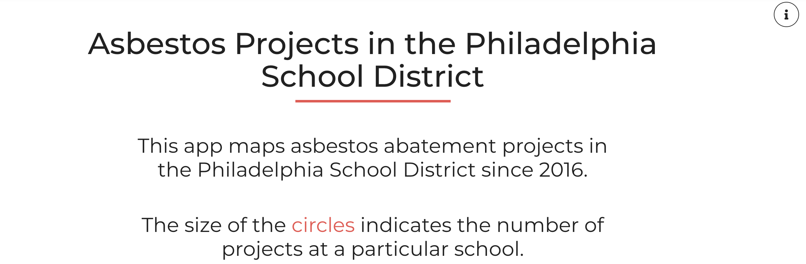
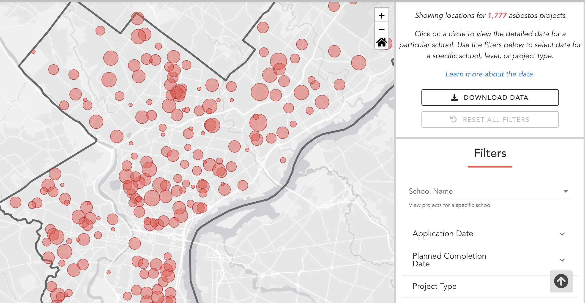

# Mapping Asbestos Projects in the Philadelphia School District

The code behind the interactive dashboard mapping asbestos projects in the School District of Philadelphia

The interactive visualization is available [here](https://controller.phila.gov/philadelphia-audits/interactive-asbestos-dashboard/#/).
For more information, see the application's [About Page](https://controller.phila.gov/philadelphia-audits/interactive-asbestos-dashboard/#/about).




## Data

The application relies on publicly available data from the Department of Public Health's [Air Management Services online portal](https://www.citizenserve.com/philagov/),

For the software and data behind the analysis for this dashboard, see the companion repository [PhiladelphiaController/asbestos-dashboard-data](https://github.com/PhiladelphiaController/asbestos-dashboard-data).

## Tools

The application is built using a combination of open-source tools, including:

- [vue](https://github.com/vuejs/vue);
- [leaflet](https://github.com/Leaflet/Leaflet) and [esri-leaflet](https://github.com/Esri/esri-leaflet);
- [vue-apexcharts](https://github.com/apexcharts/vue-apexcharts), and;
- [crossfilter](https://github.com/crossfilter/crossfilter).

## Development

First, clone the repository, and then from the root folder of the repository:

### Project setup
```
yarn install
```

### Compiles and hot-reloads for development
```
yarn run serve
```

### Compiles and minifies for production
```
yarn run build
```

